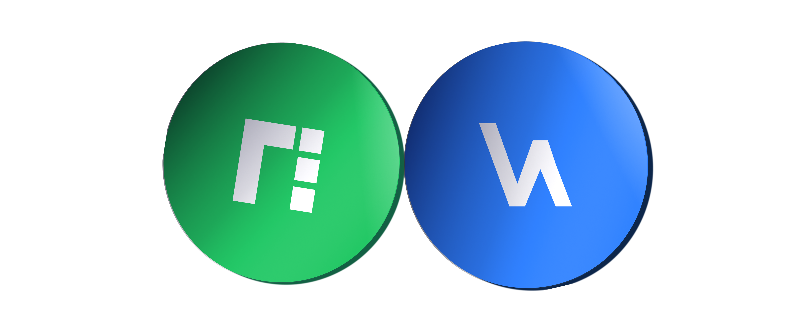

# Dual Token Ecosystem


The dual token environment is backed by the NDB token, a fixed supply token, and the Watt token, a variable supply token. Both tokens provide, each in different ways, access to and allow to benefit from the utilities and the goods and services that the NDB Ecosystems creates.


The NDB token provides access to the NDB Ecosystem overall and a number of its individual features, such as the NFTs in NDB City, Nyyu, or Charenji. They also provide some staking options as set out in the following sections. The Watt token, in turn, allows to acquire and perceive most of the energy-related services of the NDB Ecosystem and also serves as a tracking, tracing, and trading tool in this respect. As both tokens are interconnected and can be exchanged against one another, either provide access to the NDB Ecosystem's wealth.

> We choose the dual token system to bring more value to our ecosystem. With this method, we want to provide our participants with more accurate measurements of their solutions' interests by utilizing our services and products from their customer's perspectives as the validators. We achieve this by enabling participants to create profiles on our platform and a dedicated Pool.&#x20;
>
> The user also has their products pre-registered and the address corresponding to each one present in their blockchain wallet. This keeps owners accountable and mitigates environmental liability down the line. The procedure also enhances the user experience with the blockchain service.

To achieve value stability of the token, it is favorable for the token supply to have sinks - places where tokens disappear and the total token quantity decreases over time. This way, there is a more transparent and explicit fee payment for the users, instead of the "de-facto fee," which is highly variable and difficult to calculate. It is also more viable to determine the value of the protocol tokens.

During the proof-of-stake, the inclusion of new proposals into our blockchain enables people to stake their NDB token, validating the project. This decentralized form of expressing support allows community members and groups to validate the transaction blocks and indirectly act as advisors for the development of our business model.

By staking NDB tokens on the different categories of Pools, as a reward, the participants can earn NDB or Watt tokens based on their staked value. An interest-earning protocol is guided by a time series so that users can earn tokens based on the amount of tokens staked with the amount of time they are staked for.

Our second token is the Watt token. This token is the driving force behind our DApps. Watt token is of variable supply, mintable, burnable, and serves to power its applications.

Another possible function of the Watt token is monitoring energy consumption and creating a deployable application where energy consumed can be tracked.


In later stages, the Watt token may also be used as trading units of kWh energy with participating utility providers and consumers.


Watt tokens earned through staking can then be used in exchange with kWh of electricity inside the ecosystem and as a tracking mechanism, further incentivizing buy-in from providers and consumers. The model allows for a use case for NDB parking/registration and the Watt token, which operates as part of a larger energy tracking and trading solution model.

By combining this dual system, the opportunity for our products is cemented into the development of new energy cycles because of the market share of participants using the energy tracking and trading system. Development of our products allows greater exposure to the Watt network of users, creating a marketing strategy that is second to none.

