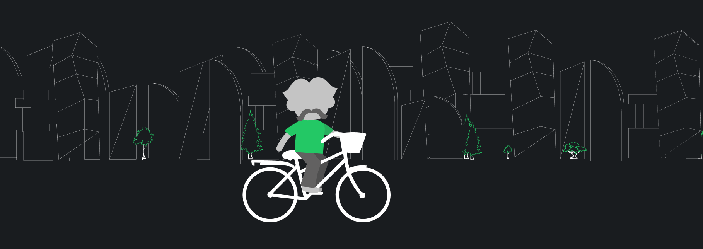

# Components

Each component is a unique non-fungible token, meaning that it is a tradable digital asset, and the owner can sell and trade it in the form of NFTs in various markets.

### Land 

The land will be one of the main components in the NDB City. It will be divided into different terrains. Habitants can own pieces of land to create buildings and businesses and develop infrastructure. The more developed the land is, the more it costs. Characters will cooperate in uniting their lands into small communes, towns, cities, and regions.

Terrains will represent different categories of land. Familiar terrain will be presented by plateau, mountain, plain, and valley. Other types include open, tundra, oasis, steppe, desert, swamp, forest, marsh, river, and hill. Inhabitants will face them less often but find rare resources in these areas.

### Resources 

Resources will play an essential role in the NDB City. We will introduce different resources, such as air, water, soil, minerals, fuels, plants, and animals.

The resources will be distributed randomly across the lands based on the terrain. The distributed resources are hidden. Characters have to mine resources using special tools.

In some cases, characters will be required to get special licenses for mining.

The landlord owns 70% of the resources located inside that land, and the NDB Hub will own the remaining 30%.

Mining the resources will incur a tax. The super tax for mining will be 30% on the profit.

Additionally, 30% of the sold mined resources will be paid to the NDB Hub.

### Buildings 

The first city in the NDB City will have some facilities at the moment of the platform's launch. We will provide citizens with necessary institutions representing NDB Hub's buildings, educational centers, centers of economic activities, and other structures. As the city grows and the welfare of its residents goes up, the inhabitants will be able to purchase the land to create their buildings, which can be used for living, business, providing utilities, social care, and other purposes. The building construction will require permissions, use resources, and builders as in real life.

### Characters 

Characters will represent real people in the NDB City. They will have a wide vest of customized features to make ideas possible. The set of skills and ability points will be available for each character. They will affect the performance of the character in different fields. Skills and ability points can be earned by studying and completing relevant activities.

### Jobs 

Jobs will be one of the main activities in the NDB City and the source of income for its residents. The income tax across the city will be set as 0% to stimulate citizens' economic development and welfare. Characters will choose the profession they want to do and develop their skills in that area.

Better skills will provide better benefits and require fewer resources for some activities.

### Utilities 

Objects in the NDB City may provide help to its holders.

Artists may create two types of NFTs within NDB's City, dynamic and static NFTs.


**Dynamic NFTs** will act as functional assets. These assets will provide revenue to the owner and are subject to operational expenses (OpEx), maintenance costs, and amortization, i.e., factories and warehouses. Typically a cement factory will generate revenue by selling cement for construction.



**Static NFTs** are non-functional assets. These assets will hold a value or be subject to growth in value rather than organic sales, such as paintings and furniture.


Residents can sell both dynamic and static NFTs through the marketplace. All NFTs are coming at a cost that should be paid to the artist. The NDB Hub will charge a 30% flat fee on every sale. The profit from NFTs is subject to NDB Hub's tax which is set at 10% for 2022.
