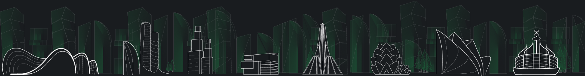

# NDB City


[NDB City](https://ndb.city) will be a metaverse aiming to educate and entertain its inhabitants. It allows to examine and simulate the NDB ecosystem. The participants will be the validators of this. Based on the availability of resources, suitable and well-performing NFTs can be translated into the real world.


[NDB City](https://ndb.city) wants to provide an opportunity to interact socially and economically in different ways, including exploration of new areas, building, or creating content and new establishments. This is a virtual world where the physical or economic barriers are faded away.

> Our metaverse begins with one city. The world will challenge its residents to develop and utilize their knowledge and skills to get more in their virtual life. There will be infrastructure and governance, which evolves in real-time.

You will be able to buy and trade land and other assets in the marketplace only with the NDB token. More information about each phase of the [NDB City](https://ndb.city) development will be communicated with the community throughout the development.
